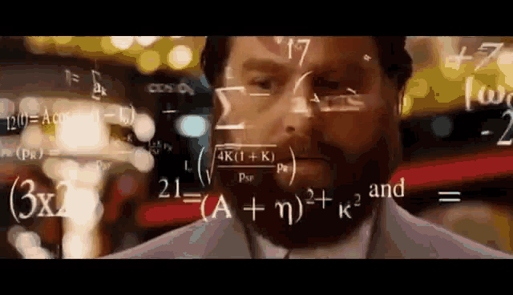

<!-- PROJECT LOGO -->
 

  

<h3 align="center">Calculus Calculator</h3>

  Explore pre-calculus concepts with this C project. It offers essential functionalities such as equation solving, graph plotting, and fundamental operations, providing a versatile and accessible tool for learners.

 

---

 
 

<!-- TABLE OF CONTENTS -->

  
Table of Contents

  <ol>
    <li>
      <a href="#about-the-project">About The Project</a>
      <ul>
        <li><a href="#built-with">Built With</a></li>
        <li><a href="#other-components">Other Components</a></li>
      </ul>
    </li>
    <li>
      <a href="#getting-started">Getting Started</a>
      <ul>
        <li><a href="#compile">Compile</a></li>
        <ul>
          <li><a href="#prerequisites">Prerequisites</a></li>
        </ul>
      </ul>
    </li>
    <li><a href="#usage">Usage</a></li>
    <li><a href="#versions">Versions</a></li>
  </ol>

 
 

---

## About The Project

A class project developed in C, focusing on fundamental programming concepts. This calculator handles area and perimeter calculations for shapes (Square, Rectangle, Triangle) using **conditionals, loops, and functions**.

#### Features
- [x] Calculate area and perimeter of Square, Rectangle, and Triangle
- [x] Implemented using basic C programming statements: conditionals, loops, functions
- [x] Designed for educational purposes and class activities

 

### Built With

Using Basic C Programming Statements.

[![C][C.com]][C-url]

[C.com]: https://img.shields.io/badge/C-A8B9CC?style=for-the-badge&logo=c&logoColor=white
[C-url]: https://en.wikipedia.org/wiki/C_(programming_language)

(<a href="#readme-top">back to top</a>)

---

 

## Getting Started

Can be run using the application or compile.
- For Application: Application can be found in bin > Debug > Pre-Calculus-Calculator-.exe
- For Compile: Compile the project using a C++ compiler

 

### Compile

#### Prerequisites

[ ] C++ Compiler

<em><strong>Note: </strong>Can use <a href="https://www.codeblocks.org/">CodeBlocks</a> or <a href="https://www.freecodecamp.org/news/how-to-write-and-run-c-cpp-code-on-visual-studio-code/">VS Code</a></em>

 

(<a href="#readme-top">back to top</a>)

---

## Usage

Can Calculate Area and Perimeter of Square, Rectangle, and Triangle.

 

(<a href="#readme-top">back to top</a>)

---

## Versions

Version List.
- 00.00.01 Adding core functionalities

<!-- - xx.xx.xx (Major Version . Minor Version . Patch Version)
  - Description -->

 

(<a href="#readme-top">back to top</a>)

